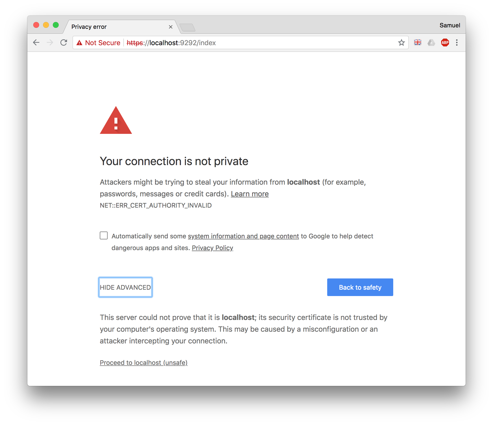

# Getting Started

This guide explains how to use `localhost` for provisioning local TLS certificates for development.

## Installation

Add the gem to your project:

~~~ bash
$ bundle add localhost
~~~

## Core Concepts

`localhost` has one core concept:

- A {ruby Localhost::Authority} instance which represents a public and private key pair that can be used for both clients and servers.

## Usage

This example shows how to generate a certificate for an SSL secured server:

``` ruby
require 'socket'
require 'thread'

require 'localhost/authority'

# Get the self-signed authority for localhost:
authority = Localhost::Authority.fetch

ready = Thread::Queue.new

# Start a server thread:
server_thread = Thread.new do
	server = OpenSSL::SSL::SSLServer.new(TCPServer.new("localhost", 4050), authority.server_context)
	
	server.listen
	
	ready << true
	
	peer = server.accept
	
	peer.puts "Hello World!"
	peer.flush
	
	peer.close
end

ready.pop

client = OpenSSL::SSL::SSLSocket.new(TCPSocket.new("localhost", 4050), authority.client_context)

# Initialize SSL connection:
client.connect

# Read the encrypted message:
puts client.read(12)

client.close
server_thread.join
```

If you use Safari to access such a server, it will allow you to add the certificate to your keychain without much work. Once you've done this, you won't need to do it again for any other site when running such a development environment from the same user account.

### Safari

If you use this with a web server, when you open the site in Safari:


  - Click "View the certificate" to check that it is the correct certificate.
  - Click "visit this website" which will prompt you to add the certificate to your keychain. Once you've done this, it should work for a long time.

### Chrome

If you use this with a web server, when you open the site in Chrome:



  - Click "ADVANCED" to see additional details, including...
  - Click "Proceed to localhost (unsafe)" which will allow you to use the site for the current browser session.

#### Self-Signed Localhost

The best way to use Chrome with self-signed localhost certificates is to allow it in your chrome settings: <chrome://flags/#allow-insecure-localhost>.

### Files

The certificate and private key are stored in `~/.localhost/`. You can delete them and they will be regenerated. If you added the certificate to your keychain, you'll probably want to delete that too.
